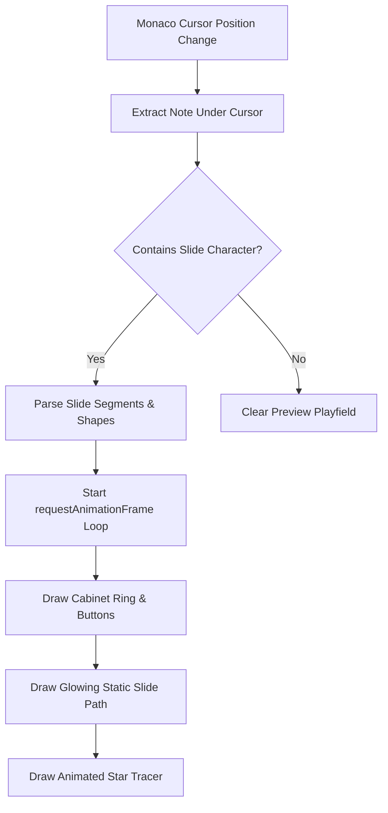

# simai Slide Path Previewer - Implementation Guide

This guide details the technical design, geometry calculations, and rendering methods required to build a real-time **Slide Path Visual Previewer** for the simai chart validator. Use this document as an expectation and reference to implement the feature in the future.

---

## 1. Architectural Concept

The goal is to render a simulated arcade cabinet playfield (`<canvas>`) on the screen. As the user moves the editor cursor over a slide note (e.g., `1-5[8:1]`), the editor extracts the note under the cursor, parses its slide shapes, and renders:
1. An outer ring with **8 numbered buttons**.
2. A **static path** representing the slide sweep direction.
3. An **animated yellow star particle tracer** running smoothly along the path.



---

## 2. Geometry & Coordinate Math

The playfield is drawn inside a square Canvas (recommended dimensions: `300` × `300` pixels).

### Reference Constants
- Center Coordinates: $(x_c, y_c) = (150, 150)$
- Outer Rim Radius: $R = 90$
- Center Rim Radius: $r_{center} = 20$
- Button Angles (clockwise from 12 o'clock, in degrees):
  - Button `1`: $22.5^\circ$
  - Button `2`: $67.5^\circ$
  - Button `3`: $112.5^\circ$
  - Button `4`: $157.5^\circ$
  - Button `5`: $202.5^\circ$
  - Button `6`: $247^\circ$
  - Button `7`: $292.5^\circ$
  - Button `8`: $337.5^\circ$

### Trigonometric Coordinate Mapping
Since HTML Canvas standard angles start at 3 o'clock ($0$ radians) and increase clockwise, the angle for button $n \in [1, 8]$ must be shifted by $-90^\circ$:
$$\theta_n = (\text{buttonAngles}[n-1] - 90) \times \frac{\pi}{180} \text{ radians}$$

Coordinates for button $n$ on the rim:
$$x_n = x_c + R \cos(\theta_n)$$
$$y_n = y_c + R \sin(\theta_n)$$

---

## 3. Parsing Notes at Editor Cursor

To support real-time previewing, the application listens to Monaco's `onDidChangeCursorPosition` event, finds the string segment containing the cursor, and parses the notes.

### Column to Segment Mapping
1. **Split by Commas**: A line is divided into steps using `,`. Identify which step the cursor column falls into.
2. **Split by EACH Dividers**: Multiple notes executed simultaneously are grouped using `/` or `` ` ``. Split the active step by these characters to get the individual note under the cursor.
3. **Regex Validation**: Check if the extracted note contains slide operators: `[><^vpqszVw-]`.

### Slide Parsing Engine
A slide note always begins with a start button `[1-8]` followed by one or more pairs of `[shape][target_button]`.
- If the note has a `*` connector (e.g. `1-5*-8`), it represents **star branching**. Split by `*` and prefix subsequent branches with the original start button `1`.
- Regex to match slide segments: `/([><^vVs-wz]|pp|qq)([1-8])/g`

---

## 4. Canvas Path Drawing & Trigonometry

When rendering a slide path on Canvas, match each shape token to its mathematical path:

### 1. Straight Line (`-`)
Connect start button to end button.
- **Canvas Math**: `ctx.lineTo(p2.x, p2.y)`

### 2. Clockwise Arc (`>`)
Sweep clockwise along the outer rim.
- **Canvas Math**:
  `let a1 = p1.angle; let a2 = p2.angle;`
  `if (a2 < a1) a2 += 2 * Math.PI;`
  `ctx.arc(xc, yc, R, a1, a2, false);`

### 3. Counter-Clockwise Arc (`<`)
Sweep counter-clockwise along the outer rim.
- **Canvas Math**:
  `let a1 = p1.angle; let a2 = p2.angle;`
  `if (a2 > a1) a2 -= 2 * Math.PI;`
  `ctx.arc(xc, yc, R, a1, a2, true);`

### 4. V-Bounce (`v` / `V`)
Draw a line to the center, then to the target.
- **Canvas Math**:
  `ctx.lineTo(xc, yc);`
  `ctx.lineTo(p2.x, p2.y);`

### 5. Curved Arc (`^`)
A parabolic curve passing close to the center.
- **Canvas Math**: Use the center $(x_c, y_c)$ as the single control point of a quadratic Bezier curve.
  `ctx.quadraticCurveTo(xc, yc, p2.x, p2.y);`

### 6. Loop / Cup (`p` / `q` or `pp` / `qq`)
A curved loop that bends inward. `p` sweeps counter-clockwise; `q` sweeps clockwise.
- **Canvas Math**: Cubic Bezier curve. Calculate control points at a radius of $0.45R$ offset by $\pm 60^\circ$ ($\frac{\pi}{3}$ rad) from the start/end angles:
  `const cp1_angle = a1 + (isCw ? 1 : -1) * Math.PI / 3;`
  `const cp2_angle = a2 + (isCw ? -1 : 1) * Math.PI / 3;`
  `ctx.bezierCurveTo(cp1.x, cp1.y, cp2.x, cp2.y, p2.x, p2.y);`

### 7. S-Curve / Z-Curve (`s` / `z`)
A symmetric wave bending to one side and then the other.
- **Canvas Math**: Cubic Bezier curve. Calculate the perpendicular vector offset from the line segment $P_1P_2$ to project control points:
  `const dx = p2.x - p1.x; const dy = p2.y - p1.y;`
  `const px = -dy; const py = dx;`
  `const len = Math.sqrt(px * px + py * py);`
  `const scale = R * 0.3 * (shape === 's' ? 1 : -1);`
  `const cp1 = { x: p1.x + dx / 3 + (px / len) * scale, y: p1.y + dy / 3 + (py / len) * scale };`
  `const cp2 = { x: p1.x + (2 * dx) / 3 - (px / len) * scale, y: p1.y + (2 * dy) / 3 - (py / len) * scale };`
  `ctx.bezierCurveTo(cp1.x, cp1.y, cp2.x, cp2.y, p2.x, p2.y);`

### 8. Fan / Wifi (`w`)
A straight line to the center, then to target, and a fan shape sweep around target.
- **Canvas Math**:
  `ctx.lineTo(xc, yc);`
  `ctx.lineTo(p2.x, p2.y);`
  `ctx.arc(xc, yc, R, targetAngle - 0.25, targetAngle + 0.25, false);`

---

## 5. Animation Math: Interpolating Positions

To draw a moving star particle along the path, calculate its coordinates $(x_t, y_t)$ given local segment progress $t \in [0, 1]$:

| Shape | Parameterized Coordinate Equation $(x(t), y(t))$ |
| :--- | :--- |
| **Line (`-`)** | $P(t) = P_1 + t(P_2 - P_1)$ |
| **Arc (`>` / `<`)** | $\theta(t) = \theta_1 + t(\theta_2 - \theta_1)$, then map to circle coordinates |
| **Bounce (`v`)** | For $t < 0.5$, interpolate between $P_1$ and Center. For $t \ge 0.5$, interpolate between Center and $P_2$. |
| **Quadratic Bezier (`^`)** | $P(t) = (1-t)^2 P_1 + 2(1-t)t P_{center} + t^2 P_2$ |
| **Cubic Bezier (`p`, `q`, `s`, `z`)**| $P(t) = (1-t)^3 P_1 + 3(1-t)^2 t CP_1 + 3(1-t) t^2 CP_2 + t^3 P_2$ |

### Multi-Segment Slides
For complex slide chains like `1-5-3` (2 segments):
1. Scale global animation progress $t_{global} \in [0, 1]$ by number of segments $N$ ($t_{scaled} = t_{global} \times N$).
2. The integer part `Math.floor(t_scaled)` identifies the active segment index.
3. The decimal part `t_scaled % 1` represents local progress $t \in [0, 1]$ inside the active segment.

---

## 6. Code Reference Template

Here is a tested reference implementation of the key visualizer functions for you to integrate when you decide to implement this feature:

```javascript
// Coordinates Helper
function getButtonCoords(n, xc = 150, yc = 150, R = 90) {
    const buttonAngles = [22.5, 67.5, 112.5, 157.5, 202.5, 247.5, 292.5, 337.5];
    const angleRad = (buttonAngles[n - 1] - 90) * Math.PI / 180;
    return {
        x: xc + R * Math.cos(angleRad),
        y: yc + R * Math.sin(angleRad),
        angle: angleRad
    };
}

// Compute Position along a Segment
function getSegmentPosition(shape, start, end, t, xc = 150, yc = 150, R = 90) {
    const p1 = getButtonCoords(start, xc, yc, R);
    const p2 = getButtonCoords(end, xc, yc, R);

    if (shape === '-') {
        return { x: p1.x + t * (p2.x - p1.x), y: p1.y + t * (p2.y - p1.y) };
    } else if (shape === '>') {
        let a1 = p1.angle;
        let a2 = p2.angle;
        if (a2 < a1) a2 += 2 * Math.PI;
        const angle = a1 + t * (a2 - a1);
        return { x: xc + R * Math.cos(angle), y: yc + R * Math.sin(angle) };
    } else if (shape === '<') {
        let a1 = p1.angle;
        let a2 = p2.angle;
        if (a2 > a1) a2 -= 2 * Math.PI;
        const angle = a1 + t * (a2 - a1);
        return { x: xc + R * Math.cos(angle), y: yc + R * Math.sin(angle) };
    } else if (shape === 'v' || shape === 'V') {
        if (t < 0.5) {
            const nt = t * 2;
            return { x: p1.x + nt * (xc - p1.x), y: p1.y + nt * (yc - p1.y) };
        } else {
            const nt = (t - 0.5) * 2;
            return { x: xc + nt * (p2.x - xc), y: yc + nt * (p2.y - yc) };
        }
    } else if (shape === '^') {
        const mt = 1 - t;
        return {
            x: mt * mt * p1.x + 2 * mt * t * xc + t * t * p2.x,
            y: mt * mt * p1.y + 2 * mt * t * yc + t * t * p2.y
        };
    } else if (['p', 'pp', 'q', 'qq'].includes(shape)) {
        const a1 = p1.angle;
        const a2 = p2.angle;
        const cp1_r = R * 0.45;
        const cp2_r = R * 0.45;
        const isCw = ['q', 'qq'].includes(shape);
        const cp1_angle = a1 + (isCw ? 1 : -1) * Math.PI / 3;
        const cp2_angle = a2 + (isCw ? -1 : 1) * Math.PI / 3;
        const cp1 = { x: xc + cp1_r * Math.cos(cp1_angle), y: yc + cp1_r * Math.sin(cp1_angle) };
        const cp2 = { x: xc + cp2_r * Math.cos(cp2_angle), y: yc + cp2_r * Math.sin(cp2_angle) };
        const mt = 1 - t;
        return {
            x: mt * mt * mt * p1.x + 3 * mt * mt * t * cp1.x + 3 * mt * t * t * cp2.x + t * t * t * p2.x,
            y: mt * mt * mt * p1.y + 3 * mt * mt * t * cp1.y + 3 * mt * t * t * cp2.y + t * t * t * p2.y
        };
    } else if (['s', 'z'].includes(shape)) {
        const dx = p2.x - p1.x;
        const dy = p2.y - p1.y;
        const px = -dy;
        const py = dx;
        const len = Math.sqrt(px * px + py * py) || 1;
        const isS = shape === 's';
        const scale = R * 0.3 * (isS ? 1 : -1);
        const cp1 = { x: p1.x + dx / 3 + (px / len) * scale, y: p1.y + dy / 3 + (py / len) * scale };
        const cp2 = { x: p1.x + (2 * dx) / 3 - (px / len) * scale, y: p1.y + (2 * dy) / 3 - (px / len) * scale };
        const mt = 1 - t;
        return {
            x: mt * mt * mt * p1.x + 3 * mt * mt * t * cp1.x + 3 * mt * t * t * cp2.x + t * t * t * p2.x,
            y: mt * mt * mt * p1.y + 3 * mt * mt * t * cp1.y + 3 * mt * t * t * cp2.y + t * t * t * p2.y
        };
    } else if (shape === 'w') {
        if (t < 0.5) {
            const nt = t * 2;
            return { x: p1.x + nt * (xc - p1.x), y: p1.y + nt * (yc - p1.y) };
        } else {
            const nt = (t - 0.5) * 2;
            return { x: xc + nt * (p2.x - xc), y: yc + nt * (p2.y - yc) };
        }
    }
    return p2;
}

// Draw a glowing 5-pointed star
function drawStar(ctx, cx, cy, spikes = 5, outerRadius = 12, innerRadius = 5) {
    let rot = Math.PI / 2 * 3;
    let x = cx;
    let y = cy;
    let step = Math.PI / spikes;

    ctx.beginPath();
    ctx.moveTo(cx, cy - outerRadius);
    for (let i = 0; i < spikes; i++) {
        x = cx + Math.cos(rot) * outerRadius;
        y = cy + Math.sin(rot) * outerRadius;
        ctx.lineTo(x, y);
        rot += step;

        x = cx + Math.cos(rot) * innerRadius;
        y = cy + Math.sin(rot) * innerRadius;
        ctx.lineTo(x, y);
        rot += step;
    }
    ctx.lineTo(cx, cy - outerRadius);
    ctx.closePath();
    ctx.fillStyle = '#ffeb3b';
    ctx.strokeStyle = '#fbc02d';
    ctx.lineWidth = 1.5;
    ctx.shadowColor = '#fbc02d';
    ctx.shadowBlur = 10;
    ctx.fill();
    ctx.stroke();
    ctx.shadowBlur = 0;
}
```
